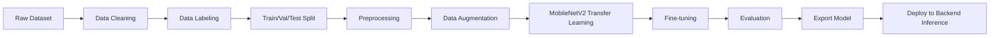

# AI_MODEL.md — PalmGuard AI

Pipeline การพัฒนา AI Model สำหรับจำแนกใบปาล์มน้ำมัน สอดคล้องกับ [ARCHITECTURE.md](ARCHITECTURE.md#ai-architecture) และ [API.md](API.md#diagnosis-endpoints)

## AI Pipeline (ภาพรวม)

Training ทำบน Google Colab, ผลลัพธ์คือไฟล์ Model ที่นำไป Deploy ใน Backend (FastAPI) สำหรับ Inference จริง

## Data Cleaning
ก่อนแบ่ง Train/Val/Test ให้รัน `python -m src.data_cleaning` (จาก `ai/`) ตรวจสอบ `ai/data/raw/<CLASS_NAME>/` ทุก Class:

| Checklist | ตรวจอัตโนมัติ | วิธีตรวจ |
|---|---|---|
| รูปเปิดได้ / ไม่มีไฟล์เสีย | ✅ | เปิดไฟล์ด้วย PIL, ไฟล์ที่เปิดไม่ได้ถูก flag เป็น corrupt |
| ไม่มีรูปซ้ำ | ✅ | Average hash (aHash) ต่อภาพ, กลุ่มที่ hash ตรงกันคือรูปซ้ำ/คล้ายกันมาก |
| ไม่มีภาพเบลอเกินไป | ✅ | Variance of Laplacian (OpenCV), ต่ำกว่า `BLUR_THRESHOLD` ถือว่าเบลอ |
| จำนวนแต่ละ Class ไม่ต่างกันมากเกินไป | ✅ | เทียบ Class ที่มีภาพมากสุด/น้อยสุด ถ้าต่างกันเกิน `MAX_CLASS_IMBALANCE_RATIO` (1.5x) จะแจ้งเตือน |
| Label ถูกต้อง | ⚠️ ตรวจได้แค่ตำแหน่งไฟล์ | ต้องอาศัยคนตรวจว่าเนื้อหาภาพตรงกับ Class ที่วางไว้จริงหรือไม่ |
| ไม่มีภาพที่ไม่เกี่ยวข้อง | ⚠️ คนตรวจ | นี่คือเหตุผลที่มี Class `NON_PALM` แยกไว้ต่างหาก แทนที่จะพึ่งการกรองด้วยมือทั้งหมด |

Threshold ทั้งสองค่า (`BLUR_THRESHOLD`, `MAX_CLASS_IMBALANCE_RATIO` ใน `ai/src/data_cleaning.py`) เป็นจุดเริ่มต้น ยังไม่ได้ปรับจูนกับ Dataset จริง (ai/data/raw ยังไม่มีภาพ)

## Dataset
- ขนาด Dataset เป้าหมาย: **4,000 ภาพรวม** แบ่ง Train 2,800 / Val 600 / Test 600 (70/15/15, ดู [Train / Validation / Test](#train--validation--test))
- **DECISION REQUIRED:** แหล่งข้อมูล, จำนวนภาพต่อ Class (การกระจายภายใน 4,000 ภาพ), และสิทธิ์การใช้งานภาพยังไม่กำหนดในเฟสนี้ — `ai/data/raw/` ยังไม่มีภาพจริง
- ภาพต้องเป็นใบปาล์มน้ำมัน ถ่ายในสภาพแสง/มุมที่หลากหลาย เพื่อให้ Model ทั่วไปมากขึ้น
- Class `NON_PALM` ต้องมีตัวอย่างภาพที่ไม่ใช่ใบปาล์มน้ำมันด้วย (เช่น แมว คน รถ ต้นไม้/ใบไม้ชนิดอื่น ดิน ท้องฟ้า สิ่งของ) เพื่อให้ Model แยกแยะภาพที่ไม่เกี่ยวข้องได้โดยตรง แทนที่จะพึ่งเกณฑ์ Confidence เพียงอย่างเดียว
- **ตั้งชื่อไฟล์ตามต้นที่ถ่าย:** `<tree_id>_<ลำดับ>.jpg` เช่น `tree001_01.jpg`, `tree001_02.jpg` สำหรับภาพที่ถ่ายจากต้นเดียวกัน — `src/dataset.py::split_dataset` จะจัดกลุ่มตาม `tree_id` และเก็บภาพทั้งหมดของต้นเดียวกันไว้ใน Split เดียวกันเสมอ (กัน Data Leakage: ถ้าภาพจากต้นเดียวกันกระจายไปอยู่ทั้ง Train และ Val/Test, Model อาจ "จำ" ต้นนั้นได้แทนที่จะเรียนรู้ลักษณะทั่วไป ทำให้ค่า Accuracy ที่วัดได้สูงเกินจริง)

## Classes
| DB Code (`disease_classes.code`) | ai/config.py `CLASS_NAMES` (folder name) | ชื่อไทย | English |
|---|---|---|---|
| `BROWN_SPOT` | `Brown_Spot` | ใบจุดสีน้ำตาล | Brown Spot / Leaf Spot |
| `HEALTHY` | `Healthy` | ใบปกติ | Healthy |
| `WHITE_SCALE` | `White_Scale` | เพลี้ยหอย | White Scale |

**เฉพาะ 3 Class นี้เท่านั้นที่ `models/mobilenetv2-v1.0.keras` (ดู [Model Deployment](#model-deployment)) ทำนายได้ — ไม่มี `NON_PALM`.**
`disease_classes` ใน [DATABASE.md](DATABASE.md) ยังมี 4 แถวเหมือนเดิม (รวม `NON_PALM`) เพราะฝั่ง Gemini (`AI_BACKEND=gemini`) ยังจำแนก `NON_PALM` ได้อยู่ — แค่ Local Model เวอร์ชันนี้ยังไม่มี Class นี้ (เทรนมาจากนอก repo นี้ ตามขอบเขต 3 Class ของข้อเสนอโครงการ ไม่ใช่จาก `ai/src/train.py` ในนี้)

**หมายเหตุเรื่อง Casing:** ai/config.py ใช้ Title_Case (`Healthy`, `Brown_Spot`, ...) เป็นชื่อโฟลเดอร์ `ai/data/raw/<CLASS_NAME>/` และเป็นค่าที่โมเดลทำนายออกมา ส่วน DB/Backend (`disease_classes.code`, Gemini prompt ใน `app/services/ai_inference.py`) ใช้ UPPER_CASE เหมือนเดิม — คนละ Namespace กัน แต่ map กันได้เสมอเพราะ `app/crud/disease.py::get_by_code()` เรียก `.upper()` ก่อนเทียบกับ DB ทุกครั้ง ส่วนที่เหลือในเอกสารนี้ (Data Cleaning, Confidence, Outcome Categories ฯลฯ) อ้างอิง Class ด้วย UPPER_CASE ตามชื่อ DB Code เพื่อไม่ให้สับสน แต่ในทางปฏิบัติของ `ai/` โค้ดจริงใช้ Title_Case ตามตารางนี้

## Image Preprocessing
- Resize เป็น 224x224 px (input size มาตรฐานของ MobileNetV2)
- Normalize pixel values ตาม MobileNetV2 preprocessing (`preprocess_input`)
- แปลง Color space เป็น RGB (ใช้ OpenCV/PIL อ่านไฟล์)
- ตรวจสอบ/ปฏิเสธไฟล์ที่ไม่ใช่ภาพ หรือขนาดเล็กเกินไปก่อนเข้าสู่ Pipeline

## Data Augmentation
ใช้เฉพาะ Train split (`ai/src/augmentation.py`):
- Random rotation
- Horizontal flip
- Vertical flip
- Random zoom
- Small translation (เลื่อนภาพเล็กน้อยตามแนวนอน/ตั้ง)
- Random brightness adjustment
- Random contrast adjustment
- เป้าหมาย: ลด Overfitting และเพิ่มความทนทานต่อสภาพแสง/มุมถ่ายภาพจริงจากมือถือ

## Train / Validation / Test
- สัดส่วนที่ตัดสินใจแล้ว: **70 / 15 / 15** — Train 2,800 / Validation 600 / Test 600 ภาพ (รวม 4,000 ภาพ, ดู [Dataset](#dataset))
- แบ่งแบบ Stratified เพื่อรักษาสัดส่วนแต่ละ Class ให้ใกล้เคียงกันในทุกชุด (ทั้ง 4 Class รวม `NON_PALM`)

## MobileNetV2
- ใช้ MobileNetV2 pretrained บน ImageNet เป็น Base Model (เหมาะกับ Mobile/Edge เนื่องจากขนาดเล็ก เร็ว)
- ตัด Top layer เดิมออก แทนที่ด้วย Classification Head ใหม่:
  `GlobalAveragePooling → Dense(128, ReLU) → Dropout(0.2) → Dense(3, Softmax)`
  (ดู `ai/src/model.py::build_model`)

## Transfer Learning
- Freeze Base Model weights ทั้งหมดในช่วงแรก
- Train เฉพาะ Classification Head ที่เพิ่มใหม่ ด้วย Dataset ใบปาล์ม

## Fine-tuning
- Unfreeze เฉพาะบาง Layer ด้านบนสุดของ MobileNetV2 หลังจาก Head เริ่ม converge — ค่า Default ของ Pipeline ในนี้ (`ai/src/train.py`, ยังไม่เคยรันจริงกับ Dataset จริง): **30 Layer บนสุด** (`config.FINE_TUNE_UNFREEZE_LAYERS`) ที่ Learning rate **1e-5** (`config.FINE_TUNE_LEARNING_RATE`)
- **โมเดลที่ใช้งานจริงตอนนี้ (`models/mobilenetv2-v1.0.keras`) เทรนจากภายนอก Pipeline นี้ ด้วยค่าต่างจาก Default ข้างต้น — ยืนยันแล้วโดยผู้เทรน:**
  - `base_model.trainable = True` แล้ว Freeze เฉพาะ 100 Layer แรก (จาก 154 Layer ของ MobileNetV2) → **Unfreeze 54 Layer บนสุด** (มากกว่าค่า Default ของ Pipeline นี้)
  - Optimizer: `tf.keras.optimizers.Adam(learning_rate=1e-4)` (สูงกว่าค่า Default `1e-5` ของ Pipeline นี้ 10 เท่า)
  - Epochs/Batch size ที่ใช้จริง — ยังไม่ได้รับแจ้ง (**DECISION REQUIRED**)

## Prediction
- Backend รับภาพ → Preprocess → ส่งเข้า Model → ได้ Probability ต่อ Class (Softmax output)
- เลือก Class ที่มีค่า Probability สูงสุดเป็นผลทำนายหลัก
- **แสดงผลแบบ Breakdown ทั้ง 3 Class:** `src/predict.py::predict()` คืน Probability ของทั้ง 3 Class จริง (ไม่ใช่แค่ Class ที่ชนะ) เป็น `class_probabilities` (Key = `disease_classes.code` ตัวใหญ่) — Persist ไว้ที่ `diagnoses.class_probabilities` (ดู [DATABASE.md](DATABASE.md#diagnoses)) และส่งกลับใน `DiagnosisResult.class_probabilities` ([API.md](API.md#request-response-structure)) ให้ Frontend แสดง "ความน่าจะเป็นในแต่ละโรค" ทีละ Class แล้วสรุปว่า Class ที่ Probability สูงสุดคือผลที่มีโอกาสเป็นมากที่สุด — ฝั่ง Gemini (`AI_BACKEND=gemini`) พยายามให้ค่านี้ด้วยเช่นกัน (ขอ `probabilities` เพิ่มใน Prompt) แต่เป็น Best-effort เพราะเป็นค่าที่ LLM ประเมินเอง ไม่ใช่ Softmax จริงเหมือนฝั่ง Local Model — Parse ไม่ได้ก็ปล่อยเป็น `null` (Frontend มี Fallback แสดง Confidence เดี่ยวแบบเดิม)

## Confidence
- Confidence Score = ค่า Probability สูงสุดจาก Softmax (0.0–1.0) ดังที่เก็บใน `diagnoses.confidence_score`
- เกณฑ์ค่า Confidence ต่ำสุดที่ถือว่า "ไม่มั่นใจ": **0.60** (`config.MIN_CONFIDENCE_THRESHOLD`) — ใช้กับทั้ง 3 Class เท่ากันหมด (ไม่มี Class พิเศษที่ข้ามเกณฑ์นี้ เพราะ Local Model เวอร์ชันนี้ไม่มี `NON_PALM` ให้ข้าม — ดู [Classes](#classes))
- ถ้า Argmax ชนะด้วยหนึ่งใน 3 Class แต่ Confidence ต่ำกว่า 0.60 จะรายงานเป็น `UNKNOWN` แทน (ภาพเบลอ/ไม่ชัดเจน หรือไม่ใช่ใบปาล์มน้ำมันเลย ก็เข้าเคสนี้เหมือนกัน เพราะไม่มี Class ปฏิเสธเฉพาะ — ดู `src/predict.py::predict`)

### Outcome Categories (สรุปผลลัพธ์ที่เป็นไปได้ทั้งหมด — Local MobileNetV2)
| กรณี | class_code ที่ได้ | ตัวอย่าง Confidence | ข้อความแนะนำสำหรับผู้ใช้ |
|---|---|---|---|
| วินิจฉัยสำเร็จ | `HEALTHY` / `BROWN_SPOT` / `WHITE_SCALE` | เช่น 96.2% | แสดงผลตาม `disease_classes.recommendation_th` ตามปกติ |
| ไม่มั่นใจ (Low Confidence) | `UNKNOWN` | เช่น 29% เมื่อทั้ง 3 Class ใกล้เคียงกัน | "ภาพไม่ชัดเจนพอให้วิเคราะห์ได้ กรุณาถ่ายภาพใหม่ให้ชัดเจนขึ้น" |

(ฝั่ง Gemini — `AI_BACKEND=gemini` — ยังมีเคส `NON_PALM` แยกต่างหากอยู่ ดู `app/services/ai_inference.py`)

**AI-layer result envelope (แนวคิด ไม่ใช่ HTTP Response จริงของ `/api/v1/diagnoses`):**
```jsonc
// วินิจฉัยสำเร็จ
{"status": "success", "class": "Brown_Spot", "confidence": 0.94}

// ไม่ใช่ใบปาล์มน้ำมัน — เฉพาะฝั่ง Gemini (AI_BACKEND=gemini) เท่านั้นที่ตอบแบบนี้ได้
// Local MobileNetV2 (mobilenetv2-v1.0.keras) ไม่มี Class นี้ — ดู Limitations
{"status": "rejected", "class": "Non_Palm"}

// ไม่มั่นใจ (ทั้ง 3 Class คะแนนใกล้เคียงกัน ไม่มี class ที่ชนะอย่างน่าเชื่อถือ)
{"status": "low_confidence"}
```
รูปแบบนี้อธิบายผลลัพธ์เชิงแนวคิดของขั้นตอน AI เท่านั้น **ไม่ใช่** รูปแบบ JSON จริงที่ `POST /api/v1/diagnoses` ส่งกลับ — Response จริง (`DiagnosisResponse`, ดู [API.md](API.md#request-response-structure)) เป็นทรง `{id, image_url, status, result: {class_code, name_th, confidence_score, recommendation_th}, created_at}` ที่ Frontend สร้างและทดสอบใช้งานจริงแล้ว การจะเปลี่ยน Response จริงให้แบนลงแบบนี้เป็น Breaking Change ต่อ Frontend (`frontend/lib/diagnoses.ts`, หน้า Result/History ทั้งหมด) — ยังไม่ได้ทำ จนกว่าจะยืนยันว่าต้องการเปลี่ยนจริง

**หมายเหตุ (ยังไม่ตัดสินใจ):** การ Persist ผลของ `NON_PALM`/`UNKNOWN` ลงตาราง `diagnoses` เป็นประวัติเหมือน Class โรคจริงหรือไม่ ยังไม่ได้ข้อสรุป — Backend ปัจจุบัน (`app/services/ai_inference.py`) บันทึกทั้งสองกรณีนี้เป็น `status="completed"`/`"failed"` ตาม Diagnosis Model ที่มีอยู่โดยไม่เพิ่ม Status ใหม่ (ไม่มีการเปลี่ยน Schema) เพื่อลดความเสี่ยงต่อระบบที่ใช้งานจริงอยู่แล้ว จนกว่าจะยืนยันแนวทางที่ต้องการ

## Evaluation Metrics
- Accuracy, Precision, Recall, F1-score, **ROC AUC** ต่อ Class (One-vs-Rest)
- Confusion Matrix เพื่อตรวจสอบ Class ที่สับสนกันบ่อย (เช่น Brown Spot vs White Scale)
- คำนวณด้วย NumPy ล้วน ไม่ใช้ scikit-learn (`ai/src/metrics.py`) — ROC AUC ใช้สูตร Rank-sum/Mann-Whitney U ตรวจสอบแล้วว่าตรงกับการกวาด Threshold แบบตรงไปตรงมา และค่าขอบเขต (Perfect separation = 1.0, สลับด้าน = 0.0, Tie ทั้งหมด = 0.5)

## Model Versioning
- ตั้งชื่อเวอร์ชันรูปแบบ `mobilenetv2-vX.Y` บันทึกใน `diagnoses.model_version` เพื่อ Trace ย้อนหลังว่าใช้ Model เวอร์ชันใดทำนาย
- เก็บไฟล์ Model แต่ละเวอร์ชันแยกกัน ไม่ Overwrite ของเดิม

## Model Deployment
- **ใช้งานจริงแล้ว:** `AI_BACKEND=mobilenet` + `MOBILENET_MODEL_PATH=ai/models/mobilenetv2-v1.2.keras` (`backend/.env`) — เวอร์ชันล่าสุด (v1.2) แทนที่ v1.1/v1.0 เดิมแล้ว (เก็บไฟล์ทั้งสองเวอร์ชันเก่าไว้ที่ `ai/models/` ไม่ลบ ตาม [Model Versioning](#model-versioning))
- v1.0, v1.1, v1.2 ทั้งสามเวอร์ชันเทรนบน Google Colab (นอก repo นี้ ไม่ผ่าน `ai/src/train.py`) ด้วยสถาปัตยกรรมเดียวกัน: `MobileNetV2(include_top=False)` + `GlobalAveragePooling2D → Dense(128, ReLU) → Dropout(0.2) → Dense(3, Softmax)` (ตรงกับที่ `ai/src/model.py` สร้าง) เทรน 2 Phase — Head (Adam 1e-3, base freeze, สูงสุด 20 epoch) แล้ว Fine-tune (freeze 100 จาก 154 Layer ของ MobileNetV2 → Unfreeze 54 Layer บนสุด, Adam 1e-5, สูงสุด 15 epoch) ทั้งสอง Phase มี EarlyStopping (patience 5, monitor val_loss) — v1.1/v1.2 จบจริงที่ ~22 epoch รวม (ดู `ai/models/training_curves-v1.2.png`) v1.2 ต่างจาก v1.1 แค่ที่ Dataset (Test Set ใหญ่ขึ้นเป็น 417 ภาพ จาก 397 — ดู [Evaluation Results](#evaluation-results-v12)) ไม่ใช่ Hyperparameter
- **⚠️ ข้อแตกต่างสำคัญจาก v1.0 ที่ต้องแก้ก่อนใช้งาน (มีผลกับทั้ง v1.1 และ v1.2):** Colab notebook เทรนด้วย `ImageDataGenerator(rescale=1./255)` (Input สเกล [0, 1]) ไม่ใช่ `preprocess_input`'s `[-1, 1]` scaling ที่ `ai/src/model.py` ฝัง Rescaling Layer ไว้ในตัวโมเดลเอง (v1.0 ใช้แบบนี้) — ถ้าเอาไฟล์ `.h5` ที่ Colab Export มาตรงๆ ไปรันผ่าน `ai/src/predict.py` (ที่ส่ง Pixel ดิบ [0, 255] เข้าโมเดล) จะได้ผลผิดทันที **แก้แล้ว (ทำซ้ำทุกเวอร์ชันที่ Import เข้ามา):** ครอบโมเดลดิบด้วย `keras.layers.Rescaling(scale=1/255)` เป็น Input Layer ใหม่ (สอบผลลัพธ์แล้วว่าตรงกับโมเดลดิบ + หาร 255 มือ ด้วยค่า diff สูงสุด < 4e-7) แล้ว Export ใหม่เป็น `mobilenetv2-vX.Y.keras` — คง Contract เดิม (ผู้เรียกส่ง Pixel ดิบ [0, 255]) ไว้ จึงไม่ต้องแก้ `ai/src/preprocessing.py`/`predict.py`/`mobilenet_inference.py` เลย
- Flow `Upload -> FastAPI -> Preprocess -> MobileNetV2 -> Prediction -> Confidence Check -> Save DB -> Response` implement ไว้ที่ `backend/app/services/mobilenet_inference.py` (import โค้ดจาก `ai/src/predict.py`/`ai/config.py` ตรงๆ ไม่ duplicate logic) เรียกผ่าน dispatcher `backend/app/services/inference.py` ที่เลือกตาม `settings.AI_BACKEND`
- **ทดสอบ End-to-end แล้วด้วยข้อมูลจริง (v1.0 เท่านั้น):** อัปโหลดภาพจริงผ่าน API → โหลด Model (~5 วิ ครั้งแรก, cache แล้ว < 0.5 วิ ครั้งถัดไป) → ได้ผลจริง เช่น `{"class_code": "BROWN_SPOT", "confidence_score": 0.96}` → บันทึกลง DB → ตอบกลับถูกต้องครบ Chain — v1.1/v1.2 ยังไม่ได้ทดสอบ End-to-end ผ่าน API จริงซ้ำ (ทดสอบแล้วเฉพาะระดับโมเดล/Preprocessing ว่าโหลดและให้ผลลัพธ์ตรงกับที่ Colab วัดไว้ — ดู [Evaluation Results](#evaluation-results-v12)) **แนะนำให้ลองอัปโหลดภาพจริงผ่าน backend ที่รันจริงอีกครั้งก่อนถือว่า v1.2 พร้อมใช้เต็มที่**
- `AI_BACKEND=gemini` (`app/services/ai_inference.py`) ยังใช้ได้เป็นทางเลือกสำรอง แต่ตอนนี้ `GEMINI_MODEL=gemini-2.0-flash` เรียก API แล้วได้ `404 Not Found` — โมเดล/เวอร์ชันนี้อาจไม่มีแล้วหรือ Key ไม่มีสิทธิ์ ยังไม่ได้แก้ (ไม่กระทบ Local Model ซึ่งเป็นค่า Default อยู่แล้ว)
- **ตัวจับภาพที่ไม่ใช่ใบปาล์ม (`ai_inference.is_palm_leaf()`, Gemini Gate ก่อนเข้า MobileNetV2) ไม่ได้แก้/ไม่ได้ลบ** — ยังทำงานเหมือนเดิมทุกครั้งที่สลับเวอร์ชัน Local Model (v1.0 → v1.1 → v1.2) เพราะไม่มีเวอร์ชันไหนมี `NON_PALM` Class ของตัวเอง (ดู [Limitations](#limitations)) จึงยังต้องพึ่ง Gate นี้เหมือนเดิม

### Evaluation Results (v1.2) — มีตัวเลขจริงแล้ว
ปิด DECISION REQUIRED เดิม (ไม่มีรายงาน Accuracy/Precision/Recall/F1) ด้วยผลจาก Colab — Test Set 417 ภาพ:

| Class | Precision | Recall | F1 | Correct/Total |
|---|---|---|---|---|
| `Brown_Spot` | 1.000 | 0.944 | 0.971 | 67/71 |
| `Healthy` | 0.984 | 0.994 | 0.989 | 180/181 |
| `White_Scale` | 0.982 | 0.994 | 0.988 | 164/165 |

**Accuracy รวม: 98.6%** (411/417) — Confusion หลักคือ `Brown_Spot` ↔ อีก 2 Class (2 ภาพทำนายเป็น Healthy, 2 ภาพทำนายเป็น White_Scale จากทั้งหมด 71 ภาพ Brown_Spot จริง)

รุ่นก่อนหน้า (v1.1, Test Set 397 ภาพ) วัดได้ 99.0% (393/397, Confusion หลักคือ `White_Scale` ↔ `Healthy` แทน) — ตัวเลขของ v1.2 ต่ำลงเล็กน้อยแต่วัดจาก Test Set ที่ใหญ่ขึ้น (มี White_Scale เพิ่มมา 20 ภาพ) จึงน่าเชื่อถือกว่าเดิมเล็กน้อย ไม่ได้แปลว่าโมเดลแย่ลง

ไฟล์เต็ม: `ai/models/evaluation-v1.2.json` (มี Confusion Matrix ดิบ), `ai/models/classification_report-v1.2.txt`, `ai/models/confusion_matrix-v1.2.png`, `ai/models/training_curves-v1.2.png` (v1.1 มีไฟล์ชุดเดียวกันภายใต้ `-v1.1` สำหรับเทียบ) — สร้างด้วย `ai/src/metrics.py`/`ai/src/report.py` ตัวเดียวกับที่ `ai/src/train.py` จะใช้ (ไม่ได้เขียน Logic ซ้ำ) ROC AUC ไม่มีในรายงานนี้เพราะข้อมูลที่ได้จาก Colab มีแค่ Confusion Matrix (ไม่มี Softmax Probability รายภาพ)

**⚠️ ข้อควรระวังก่อนเชื่อตัวเลขนี้เต็มที่ (มีผลกับทั้ง v1.1 และ v1.2):** Colab notebook ใช้ `flow_from_directory` แบ่ง Train/Val/Test ตามโฟลเดอร์ตรงๆ **ไม่พบการ Group ภาพตาม `tree_id` ก่อน Split** ตามที่ [Dataset](#dataset) กำหนดไว้ (กัน Data Leakage) — ถ้า Dataset จริงมีหลายภาพต่อต้นเดียวกันกระจายอยู่คนละ Split, ตัวเลขนี้อาจสูงเกินจริง **DECISION REQUIRED:** ต้องยืนยันกับผู้เทรนว่า Dataset ที่ใช้เทรน v1.2 Group ตาม Tree ก่อน Split หรือไม่ ก่อนอ้างตัวเลขนี้ในรายงานทางการของโครงการ (วัตถุประสงค์ข้อ 5.3.2)

## Limitations
- ผลลัพธ์เป็น "คำแนะนำเบื้องต้น" เท่านั้น ไม่ใช่การวินิจฉัยทางการเกษตรอย่างเป็นทางการ
- ความแม่นยำขึ้นกับคุณภาพภาพถ่าย (แสง, มุม, ความคมชัด) และความหลากหลายของ Dataset ที่ใช้ Train — v1.2 มี Test Accuracy 98.6% (ดู [Evaluation Results](#evaluation-results-v12)) แต่ยังไม่ยืนยันว่า Split ป้องกัน Data Leakage ตาม Tree หรือไม่ ตัวเลขนี้จึงเป็น "ตัวเลขที่ดีที่สุดเท่าที่มี" ไม่ใช่ตัวเลขที่ยืนยันความทั่วไป (Generalization) แล้ว
- รองรับเฉพาะ 3 Class (`Brown_Spot`/`Healthy`/`White_Scale`) — **ไม่มี `NON_PALM`** ในโมเดลนี้ (ทุกเวอร์ชัน v1.0-v1.2) ภาพที่ไม่ใช่ใบปาล์มน้ำมันเลยอาจถูกจัดเป็น `UNKNOWN` (ถ้า Confidence ต่ำ) หรือแย่กว่านั้นคือถูกจัดเข้ากลุ่มใดกลุ่มหนึ่งอย่างมั่นใจผิดๆ ก็ได้ (ทดสอบแล้วด้วยภาพ Noise สุ่ม — โมเดลทำนาย "Healthy" มั่นใจ 99% ไม่ใช่ UNKNOWN) — นี่คือเหตุผลที่ยังคง Gemini Gate (`ai_inference.is_palm_leaf()`) ไว้ก่อนเข้าโมเดลนี้เสมอ (ดู [Model Deployment](#model-deployment)) แทนที่จะพึ่ง Confidence Threshold อย่างเดียว
- ภาพคุณภาพต่ำ (เบลอ, แสงไม่พอ) ของใบปาล์มจริง อาจถูกจัดเป็น `UNKNOWN` โดยเกณฑ์ Confidence สำรอง (ดู [Confidence](#confidence))
- **พบและแก้แล้ว:** Gemini Gate (`is_palm_leaf()`) เคยปฏิเสธภาพใบปาล์มจริงที่เป็นโรคผิด (False Negative) — เจอกับภาพถ่ายมาโครระยะใกล้มากที่มีเพลี้ยหอยเกาะหนาแน่นเต็มเฟรม (Gate ตอบ `false` มั่นใจ 95% ซ้ำ 4 ครั้ง ทั้งที่โมเดล MobileNetV2 ทำนายถูกเป็น `White_Scale` 75.7% confidence) แก้โดยปรับ `_GATE_PROMPT` ให้อธิบายชัดว่าภาพมาโครที่เห็นรอยโรค/แมลงเกาะหนาแน่นยังนับเป็น "ภาพใบปาล์ม" ทดสอบ Regression แล้วว่ายังปฏิเสธภาพที่ไม่ใช่ใบปาล์มถูกต้อง (เช่น Screenshot) — ยังต้องเฝ้าดูต่อว่ามีภาพเคสอื่นที่ Gate ยังปฏิเสธผิดอีกหรือไม่ เพราะเป็นการแก้ด้วย Prompt (ไม่ได้แก้ที่ตัวโมเดล Gemini เอง)
