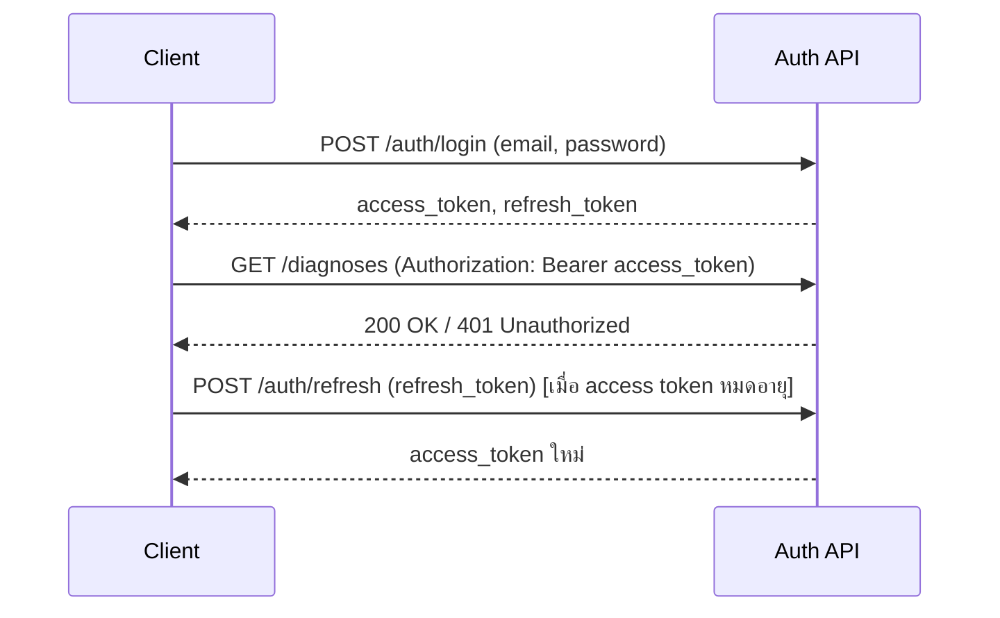

# API.md — PalmGuard AI

REST API ออกแบบให้สอดคล้องกับ Schema ใน [DATABASE.md](DATABASE.md) Base path: `/api/v1`

## API Architecture
- FastAPI + Pydantic Schema สำหรับ Request/Response Validation
- REST, JSON เป็นหลัก (Multipart/form-data สำหรับ Upload ภาพ)
- Auth: JWT Bearer Token ใน Header `Authorization: Bearer <access_token>`
- Role-based: บาง Endpoint จำกัดเฉพาะ role `admin`

## Authentication Endpoints
| Method | Endpoint | Auth | Description |
|---|---|---|---|
| POST | /auth/register | Public | สมัครสมาชิกใหม่ |
| POST | /auth/login | Public | เข้าสู่ระบบ, คืน access/refresh token |
| POST | /auth/refresh | Public (ใช้ refresh token) | ขอ access token ใหม่ |
| POST | /auth/logout | Required | Revoke refresh token (**DECISION REQUIRED**: เก็บ token blacklist หรือไม่) |

## User Endpoints
| Method | Endpoint | Auth | Description |
|---|---|---|---|
| GET | /users/me | Required | ดูข้อมูลโปรไฟล์ตนเอง |
| PATCH | /users/me | Required | แก้ไขข้อมูลโปรไฟล์ (full_name, phone_number) |

## Diagnosis Endpoints
| Method | Endpoint | Auth | Description |
|---|---|---|---|
| POST | /diagnoses | Required | อัปโหลดภาพ + สั่งวิเคราะห์ (image เป็น multipart/form-data) |
| GET | /diagnoses | Required | ดูประวัติวินิจฉัยของตนเอง (pagination) |
| GET | /diagnoses/{id} | Required (เจ้าของ หรือ admin) | ดูรายละเอียดผลวินิจฉัย 1 รายการ |

## Disease Endpoints
| Method | Endpoint | Auth | Description |
|---|---|---|---|
| GET | /diseases | Public | รายการ Disease Class ทั้งหมด (ชื่อ, คำอธิบาย, คำแนะนำ) |
| GET | /diseases/{code} | Public | รายละเอียด Disease Class ตาม code |

## Survey Endpoints
| Method | Endpoint | Auth | Description |
|---|---|---|---|
| POST | /surveys | Required | ส่งแบบสอบถามความพึงพอใจ (UAT) |

## Admin Endpoints
| Method | Endpoint | Auth | Description |
|---|---|---|---|
| GET | /admin/users | admin | รายชื่อผู้ใช้ทั้งหมด (pagination) |
| GET | /admin/diagnoses | admin | รายการวินิจฉัยทั้งระบบ (pagination, filter) |
| GET | /admin/surveys | admin | รายการแบบสอบถามความพึงพอใจทั้งหมด (pagination) |
| GET | /admin/surveys/summary | admin | สรุปคะแนนเฉลี่ยและอัตราการแนะนำระบบจากแบบสอบถามทั้งหมด |

**DECISION REQUIRED:** ขอบเขต Admin (read-only ตาม MVP หรือรวม CRUD จัดการผู้ใช้/disease_classes) — อ้างอิง [PROJECT.md](PROJECT.md#mvp-scope)

## Request/Response Structure

**ตัวอย่าง POST /auth/register**
```json
// Request
{
  "email": "somchai.farmer@example.com",
  "password": "********",
  "full_name": "สมชาย ใจดี",
  "phone_number": "0891234567"
}
// Response 201
{
  "id": "b3f1c2a0-1111-4a2b-9c3d-000000000001",
  "email": "somchai.farmer@example.com",
  "full_name": "สมชาย ใจดี",
  "role": "farmer",
  "created_at": "2026-08-21T09:00:00+07:00"
}
```

**ตัวอย่าง POST /diagnoses**
```json
// Request: multipart/form-data { image: <file> }
// Response 201
{
  "id": "d4a2e5f0-2222-4b3c-8d4e-000000000099",
  "image_url": "https://storage.example.com/palmguard/2026/08/leaf_099.jpg",
  "status": "completed",
  "result": {
    "class_code": "BROWN_SPOT",
    "name_th": "ใบจุดสีน้ำตาล",
    "confidence_score": 0.9123,
    "recommendation_th": "เฝ้าระวังการขยายตัวของจุดสีน้ำตาลบนใบ และเน้นการป้องกันการแพร่กระจายของเชื้อ พิจารณาใช้ชีวภัณฑ์หรือสารควบคุมเชื้อราที่เหมาะสมตามคำแนะนำของผู้เชี่ยวชาญ",
    "class_probabilities": {"BROWN_SPOT": 0.9123, "HEALTHY": 0.0512, "WHITE_SCALE": 0.0365}
  },
  "created_at": "2026-08-21T09:05:00+07:00"
}
```
`result.class_probabilities` คือความน่าจะเป็นของแต่ละ Class (0.0–1.0, ไม่รวม `NON_PALM`) สำหรับแสดงผล "ความน่าจะเป็นในแต่ละโรค" เต็มรูปแบบ — เป็น `null` สำหรับ Diagnosis เก่าก่อนมี Field นี้ หรือกรณีที่ AI Backend สร้างค่านี้ไม่ได้ (ดู [AI_MODEL.md#prediction](AI_MODEL.md#prediction))

## HTTP Status Codes
| Code | Meaning | Usage |
|---|---|---|
| 200 | OK | คำขอสำเร็จ (GET/PATCH) |
| 201 | Created | สร้างข้อมูลสำเร็จ (Register, Diagnosis) |
| 400 | Bad Request | ข้อมูล/ไฟล์ภาพไม่ถูกต้อง |
| 401 | Unauthorized | ไม่มี/หมดอายุ Token |
| 403 | Forbidden | ไม่มีสิทธิ์เข้าถึง (เช่น role ไม่ใช่ admin) |
| 404 | Not Found | ไม่พบข้อมูล |
| 422 | Unprocessable Entity | Validation error (Pydantic) |
| 500 | Internal Server Error | ข้อผิดพลาดฝั่งเซิร์ฟเวอร์/AI Model |

## Authentication Flow


## Error Response Format
```json
{
  "error": {
    "code": "VALIDATION_ERROR",
    "message": "รูปแบบอีเมลไม่ถูกต้อง",
    "details": [
      { "field": "email", "issue": "invalid format" }
    ]
  }
}
```
