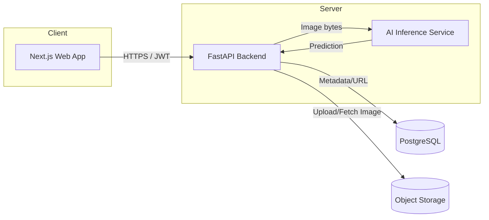
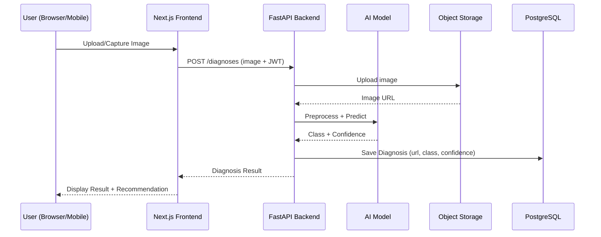
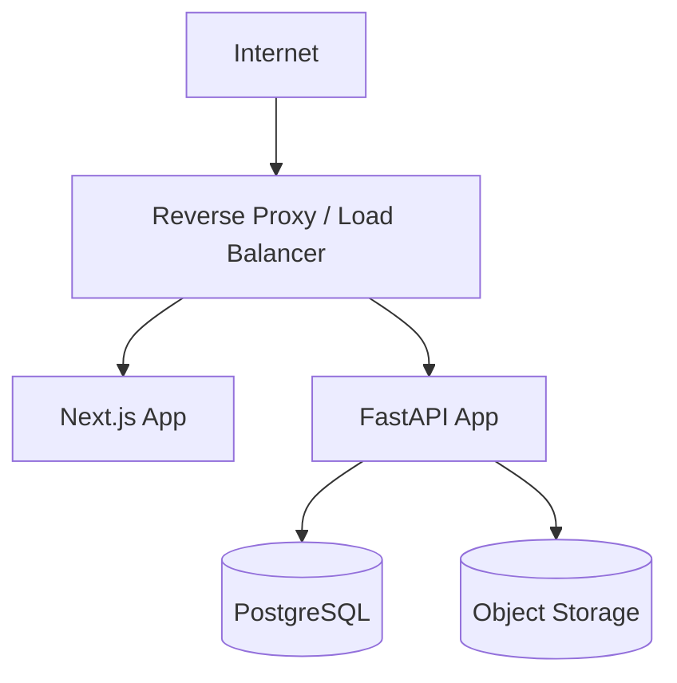

# ARCHITECTURE.md — PalmGuard AI

อ้างอิงขอบเขตโครงงานจาก [PROJECT.md](PROJECT.md)

## System Architecture

Frontend, Backend API, และ AI Inference แยกกันตามความรับผิดชอบ (Separation of Concerns) แต่ AI Inference ในระยะ MVP รันเป็น Module ภายใน Backend process เดียวกัน (ไม่ใช่ Microservice แยก) เพื่อลดความซับซ้อน

## Frontend Architecture
- Next.js (App Router) + TypeScript
- Tailwind CSS + shadcn/ui สำหรับ UI Component
- Lucide Icons สำหรับไอคอน, Noto Sans Thai เป็น Font หลัก
- เรียก Backend ผ่าน REST API (fetch) พร้อมแนบ JWT Access Token ใน Header
- Client-side state: Auth token, ผลลัพธ์ preview ก่อน submit

## Backend Architecture
- FastAPI เป็น Web Framework, Pydantic สำหรับ Schema/Validation
- SQLAlchemy เป็น ORM เชื่อมต่อ PostgreSQL
- JWT Authentication (Access Token + Refresh Token) ดูรายละเอียดใน [API.md](API.md)
- แบ่งเป็น Layer: Router → Service → Repository (SQLAlchemy Models)
- รับภาพจาก Client → ส่งต่อ AI Module → บันทึกผลลง Database → อัปโหลดภาพไป Object Storage

## AI Architecture
- Model หลัก: MobileNetV2 (Transfer Learning จาก ImageNet weights + Fine-tuning)
- Input: ภาพใบปาล์ม → Preprocessing (Resize, Normalize) ด้วย OpenCV/PIL
- Output: Class (Healthy / Brown Spot / White Scale) + Confidence Score
- Training แยกทำบน Google Colab, ได้ไฟล์ Model (.h5/SavedModel) นำมาวางในฝั่ง Backend เพื่อ Inference
- รายละเอียด Pipeline ดู [AI_MODEL.md](AI_MODEL.md)

## Database Architecture
- PostgreSQL เก็บข้อมูล Users, Disease Classes, Diagnoses (Metadata + Image URL)
- ไม่เก็บไฟล์ภาพจริงในฐานข้อมูล เก็บเฉพาะ URL ที่ชี้ไป Object Storage
- รายละเอียด Schema ดู [DATABASE.md](DATABASE.md)

## Storage Architecture
- Object Storage เก็บไฟล์ภาพต้นฉบับ (และ thumbnail ถ้ามี)
- Backend เป็นตัวกลางในการ Upload/Generate URL ให้ Client (Client ไม่ติดต่อ Object Storage โดยตรงใน MVP)
- **ตัดสินใจแล้ว (สำหรับ Deploy demo/UAT):** Supabase Storage — Free Tier ไม่ต้องผูกบัตรเครดิต (ต่างจาก Cloudflare R2 ที่ต้องผูกบัตรตั้งแต่สมัคร) และอยู่ในโปรเจกต์ Supabase เดียวกับ PostgreSQL ด้านบน ลดจำนวนบริการที่ต้องจัดการ — implement เป็น `SupabaseImageStorage` (`backend/app/services/storage.py`, เลือกด้วย `STORAGE_BACKEND=supabase` ใน `.env`) เรียก Supabase Storage REST API ตรงๆ ผ่าน `httpx` (ไม่เพิ่ม Dependency ใหม่) — Local Disk (`STORAGE_BACKEND=local`, Default) ยังใช้สำหรับ Dev ในเครื่องเหมือนเดิม
- **ข้อจำกัด Free Tier ที่ต้องรู้:** Supabase Project (ทั้ง Database และ Storage) จะ Pause อัตโนมัติถ้าไม่มีการใช้งานติดต่อกัน 7 วัน (กด Unpause เองได้ที่ Dashboard ไม่เสียเงิน แต่ต้องเช็คก่อนสอบ/เดโม)

## Request Flow


## Deployment Architecture

- **DECISION REQUIRED:** Hosting/Infra จริง (Cloud provider, container orchestration) ยังไม่กำหนดในเฟสเอกสารนี้ — ไม่สร้าง Dockerfile/Config ใน Phase นี้ตามข้อกำหนด

## Security Overview
- JWT Authentication สำหรับทุก Endpoint ที่ต้อง Login (ยกเว้น Register/Login/Public content)
- Password Hashing ก่อนบันทึกลง Database (Bcrypt/Argon2 — เลือกจริงในเฟส Implementation)
- Role-based Access Control พื้นฐาน: `farmer`, `admin`
- Validate/Sanitize ไฟล์ภาพที่อัปโหลด (นามสกุล, ขนาดไฟล์, MIME type)
- HTTPS สำหรับทุกการสื่อสาร Client-Server

## Folder Structure
โครงสร้างระดับสูง (แนวคิด ยังไม่สร้างจริงใน Phase นี้):
```
palmguard-ai/
├── frontend/          # Next.js app
├── backend/           # FastAPI app
├── ai/                # Training notebooks, model artifacts
└── docs/              # Documentation (Phase ปัจจุบัน)
```

## Technology Responsibilities
| Technology | Responsibility |
|---|---|
| Next.js + TypeScript | UI Rendering, Routing, Client-side validation |
| Tailwind + shadcn/ui | Styling, UI Components |
| FastAPI + Pydantic | REST API, Request/Response Validation |
| SQLAlchemy | ORM / Database Access |
| PostgreSQL | Persistent storage (Users, Diagnoses, Disease info) |
| TensorFlow/Keras (MobileNetV2) | Image Classification Model |
| OpenCV/PIL | Image Preprocessing |
| Object Storage | เก็บไฟล์ภาพ |
| JWT | Authentication/Authorization |
