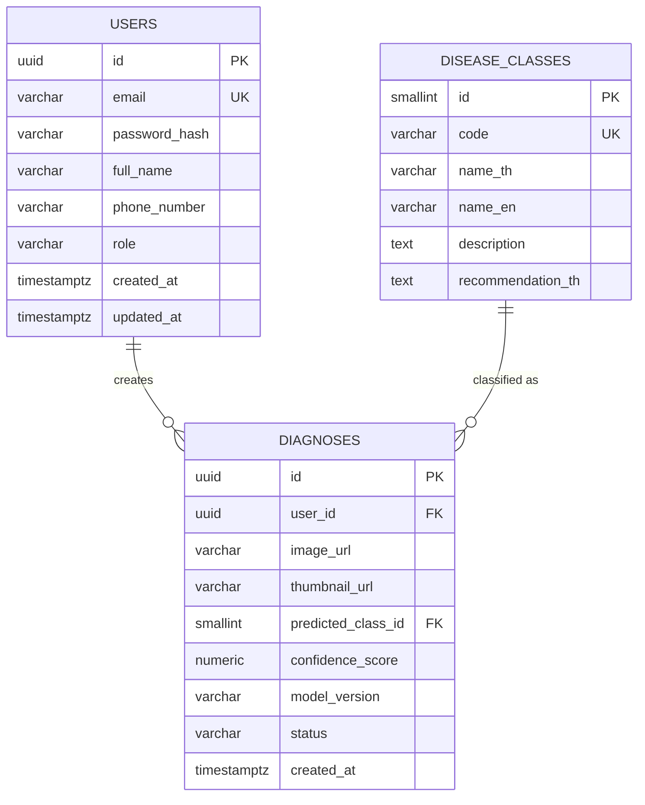

# DATABASE.md — PalmGuard AI

PostgreSQL Schema ระดับ MVP ตามขอบเขตใน [PROJECT.md](PROJECT.md) และสอดคล้องกับ [API.md](API.md)

## Database Design
4 ตารางหลัก: `users`, `disease_classes`, `diagnoses`, `satisfaction_surveys`
- `users` 1 คน มีได้หลาย `diagnoses` (1:N)
- `users` 1 คน ส่งแบบสอบถามได้หลายครั้ง `satisfaction_surveys` (1:N)
- `disease_classes` 1 class ถูกใช้ในหลาย `diagnoses` (1:N)
- ไม่มีตารางภาพแยก (Image URL/Metadata เก็บใน `diagnoses` โดยตรง) เพื่อความเรียบง่ายตามขอบเขต MVP

## ERD (Mermaid)


## Tables

### users
| Column | Type | Constraint | Description |
|---|---|---|---|
| id | UUID | PK, default gen_random_uuid() | รหัสผู้ใช้ |
| email | VARCHAR(255) | UNIQUE, NOT NULL | อีเมลใช้ login |
| password_hash | VARCHAR(255) | NOT NULL | รหัสผ่านที่ hash แล้ว |
| full_name | VARCHAR(150) | NOT NULL | ชื่อ-นามสกุล |
| phone_number | VARCHAR(20) | NULL | เบอร์โทร (optional) |
| role | VARCHAR(20) | NOT NULL, default 'farmer' | 'farmer' หรือ 'admin' |
| created_at | TIMESTAMPTZ | NOT NULL, default now() | วันที่สร้างบัญชี |
| updated_at | TIMESTAMPTZ | NOT NULL, default now() | วันที่แก้ไขล่าสุด |

### disease_classes
| Column | Type | Constraint | Description |
|---|---|---|---|
| id | SMALLINT | PK | รหัส class |
| code | VARCHAR(50) | UNIQUE, NOT NULL | รหัสอ้างอิง เช่น HEALTHY |
| name_th | VARCHAR(100) | NOT NULL | ชื่อภาษาไทย |
| name_en | VARCHAR(100) | NOT NULL | ชื่อภาษาอังกฤษ |
| description | TEXT | NULL | คำอธิบายอาการ |
| recommendation_th | TEXT | NULL | คำแนะนำเบื้องต้น (ภาษาไทย) |

Seed ข้อมูลเริ่มต้น (ตัวอย่าง ไม่ใช่ SQL migration):
| id | code | name_th | name_en |
|---|---|---|---|
| 1 | HEALTHY | ใบปกติ | Healthy |
| 2 | BROWN_SPOT | ใบจุดสีน้ำตาล | Brown Spot / Leaf Spot |
| 3 | WHITE_SCALE | เพลี้ยหอย | White Scale |
| 4 | NON_PALM | ไม่ใช่ใบปาล์มน้ำมัน | Non-Palm / Not a Palm Leaf |

### diagnoses
| Column | Type | Constraint | Description |
|---|---|---|---|
| id | UUID | PK, default gen_random_uuid() | รหัสรายการวินิจฉัย |
| user_id | UUID | FK → users.id, NOT NULL | ผู้ทำรายการ |
| image_url | VARCHAR(500) | NOT NULL | URL ภาพต้นฉบับใน Object Storage |
| thumbnail_url | VARCHAR(500) | NULL | URL ภาพขนาดย่อ |
| predicted_class_id | SMALLINT | FK → disease_classes.id, NULL | ผลทำนาย (NULL ถ้า status ยังไม่เสร็จ) |
| confidence_score | NUMERIC(5,4) | NULL | ค่าความเชื่อมั่นของ Class ที่ทำนายได้ (ค่าสูงสุดใน class_probabilities) 0.0–1.0 |
| class_probabilities | JSON | NULL | ความน่าจะเป็นของทั้ง 3 Class จริง (`{"BROWN_SPOT": 0.9, "HEALTHY": 0.05, "WHITE_SCALE": 0.05}`) — เพิ่มใน Migration `0003_diagnosis_class_probabilities`, NULL สำหรับแถวเก่าก่อนมี Column นี้ |
| model_version | VARCHAR(50) | NULL | เวอร์ชัน Model ที่ใช้ทำนาย |
| status | VARCHAR(20) | NOT NULL, default 'processing' | 'processing' / 'completed' / 'failed' |
| created_at | TIMESTAMPTZ | NOT NULL, default now() | วันเวลาที่ส่งวินิจฉัย |

### satisfaction_surveys
| Column | Type | Constraint | Description |
|---|---|---|---|
| id | UUID | PK, default gen_random_uuid() | รหัสแบบสอบถาม |
| user_id | UUID | FK → users.id, NOT NULL | ผู้ตอบแบบสอบถาม |
| satisfaction_rating | SMALLINT | NOT NULL, 1–5 | ความพึงพอใจโดยรวมต่อระบบ |
| ease_of_use_rating | SMALLINT | NOT NULL, 1–5 | ความง่ายในการใช้งาน |
| accuracy_rating | SMALLINT | NOT NULL, 1–5 | ความพึงพอใจต่อความแม่นยำของผลวินิจฉัย |
| would_recommend | BOOLEAN | NOT NULL | จะแนะนำระบบต่อหรือไม่ |
| comments | TEXT | NULL | ความคิดเห็นเพิ่มเติม |
| created_at | TIMESTAMPTZ | NOT NULL, default now() | วันเวลาที่ส่งแบบสอบถาม |

## Relationships
- `diagnoses.user_id` → `users.id` (ON DELETE CASCADE — ลบผู้ใช้แล้วลบประวัติ, **DECISION REQUIRED** ยืนยัน policy นี้กับผู้เกี่ยวข้อง)
- `diagnoses.predicted_class_id` → `disease_classes.id` (ON DELETE RESTRICT)
- `satisfaction_surveys.user_id` → `users.id` (ON DELETE CASCADE)

## Indexes
| Table | Index | Purpose |
|---|---|---|
| users | UNIQUE(email) | ป้องกันอีเมลซ้ำ, ใช้ตอน login |
| diagnoses | INDEX(user_id) | Query ประวัติของผู้ใช้ |
| diagnoses | INDEX(created_at) | เรียงลำดับ/แบ่งหน้าประวัติ |
| diagnoses | INDEX(predicted_class_id) | สถิติ Admin ตาม class |

## Example Records

**users**
```json
{
  "id": "b3f1c2a0-1111-4a2b-9c3d-000000000001",
  "email": "somchai.farmer@example.com",
  "full_name": "สมชาย ใจดี",
  "phone_number": "0891234567",
  "role": "farmer",
  "created_at": "2026-07-01T09:00:00+07:00"
}
```

**diagnoses**
```json
{
  "id": "d4a2e5f0-2222-4b3c-8d4e-000000000099",
  "user_id": "b3f1c2a0-1111-4a2b-9c3d-000000000001",
  "image_url": "https://storage.example.com/palmguard/2026/08/leaf_099.jpg",
  "predicted_class_id": 2,
  "confidence_score": 0.9123,
  "class_probabilities": {"BROWN_SPOT": 0.9123, "HEALTHY": 0.0512, "WHITE_SCALE": 0.0365},
  "model_version": "mobilenetv2-v1.2",
  "status": "completed",
  "created_at": "2026-08-20T14:32:00+07:00"
}
```

## Open Items
- **DECISION REQUIRED:** ต้องมีตาราง Diagnosis History แยกจาก `diagnoses` หรือไม่ (ปัจจุบันถือว่า `diagnoses` = History ในตัว)
- **DECISION REQUIRED:** Cascade/Retention policy เมื่อผู้ใช้ลบบัญชี
