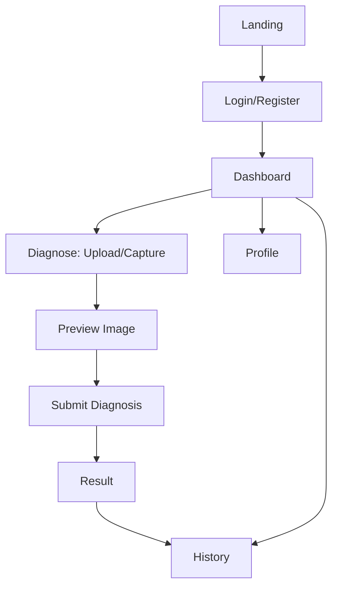

# UI.md — PalmGuard AI

ออกแบบให้เหมาะกับเกษตรกร ใช้งานง่าย รองรับมือถือเป็นหลัก (Mobile-first) สอดคล้องขอบเขตฟีเจอร์ใน [PROJECT.md](PROJECT.md)

## Design System
- ใช้ shadcn/ui เป็นฐาน Component + Tailwind CSS สำหรับ Styling
- Lucide Icons สำหรับไอคอนทั้งระบบ
- ภาษาไทยเป็นหลัก, English สำหรับ technical term (เช่น "Confidence", "Login")

## Color Palette
| Token | สี | การใช้งาน |
|---|---|---|
| Primary | เขียวปาล์ม `#2E7D32` | ปุ่มหลัก, Header, Active state |
| Primary Light | `#66BB6A` | Hover, Highlight |
| Secondary | น้ำตาลดิน `#8D6E63` | ป้าย/สถานะรอง |
| Success | `#43A047` | ผล Healthy |
| Warning | `#FB8C00` | ผล Brown Spot/Leaf Spot |
| Danger | `#E53935` | ผล White Scale / Error |
| Background | `#F7F8F5` | พื้นหลังหน้าเว็บ |
| Surface | `#FFFFFF` | Card, Modal |
| Text Primary | `#1B1B1B` | ข้อความหลัก |
| Text Secondary | `#5F6368` | ข้อความรอง |

*(**DECISION REQUIRED**: ยืนยันโทนสีสุดท้ายกับผู้มีส่วนได้ส่วนเสีย/แบรนด์ ถ้ามี)*

## Typography
- Font หลัก: Noto Sans Thai (รองรับไทย+อังกฤษในฟอนต์เดียว)
- Scale: `text-2xl` (H1, 24–28px) / `text-xl` (H2) / `text-base` (Body, 16px ขั้นต่ำเพื่อการอ่านบนมือถือ) / `text-sm` (Caption)
- Font weight: 700 (Heading), 500 (ปุ่ม/label), 400 (เนื้อหา)

## Spacing
- ใช้ scale ของ Tailwind มาตรฐาน (4px base): `p-2, p-4, p-6, p-8`
- ระยะห่างระหว่าง Section: `py-8` (mobile) / `py-12` (desktop)
- Touch target ขั้นต่ำ 44x44px สำหรับปุ่ม/องค์ประกอบที่กดได้

## Border Radius
- Card/Input: `rounded-xl` (12px)
- Button: `rounded-lg` (8px)
- Avatar/Badge: `rounded-full`

## Buttons
| Variant | การใช้งาน |
|---|---|
| Primary (filled, เขียว) | Action หลัก เช่น "วิเคราะห์ภาพ", "เข้าสู่ระบบ" |
| Secondary (outline) | Action รอง เช่น "ยกเลิก", "เลือกภาพใหม่" |
| Destructive | ลบ/ยกเลิกรายการ (ถ้ามีใน MVP) |
| Icon Button | ปุ่มถ่ายภาพ/สลับกล้อง |

## Cards
- Diagnosis Result Card: ภาพย่อ, Class name (TH/EN), Confidence (%), คำแนะนำเบื้องต้น, timestamp
- History List Item Card: ภาพย่อ, Class, วันที่, Badge สี (ตาม Success/Warning/Danger)

## Form Components
- Input, Textarea, Select จาก shadcn/ui
- Image Upload/Camera Capture component (Preview ก่อน Submit)
- Validation message แสดงใต้ field เป็นภาษาไทย

## Navigation
- Mobile: Bottom Navigation Bar (Dashboard, Diagnose, History, Profile)
- Desktop/Tablet: Top Navigation Bar + เมนูเดียวกัน
- Admin: เมนูแยกต่างหาก เข้าถึงเฉพาะ role admin

## Responsive Behavior
- Breakpoint หลัก: mobile (<640px) เป็น default, `md:` (≥768px) ปรับ layout เป็นหลายคอลัมน์
- ปุ่ม Diagnose หลักอยู่ตำแหน่งเข้าถึงง่ายด้วยนิ้วโป้งบนมือถือ (bottom area)
- รูปภาพ preview ปรับขนาดตาม container เสมอ (object-fit: cover)

## Page List
1. Landing Page (`/`)
2. Register (`/register`)
3. Login (`/login`)
4. Dashboard (`/dashboard`)
5. Diagnose — Upload/Capture (`/diagnose`)
6. Result (`/diagnose/[id]/result`)
7. Diagnosis History (`/history`)
8. Profile (`/profile`)
9. Admin Dashboard (`/admin`)

## Page Layout (ภาพรวม)
- **Landing**: Hero + คำอธิบายระบบ + ปุ่ม Login/Register
- **Dashboard**: สรุปจำนวนการวินิจฉัย, ปุ่ม "วินิจฉัยใหม่" เด่นที่สุด, รายการล่าสุด
- **Diagnose**: ปุ่มถ่ายภาพ/อัปโหลด → Preview → ปุ่ม "ส่งวิเคราะห์"
- **Result**: Diagnosis Result Card + ปุ่ม "ดูประวัติ"/"วินิจฉัยใหม่" + ข้อความ disclaimer เสมอ
- **History**: List แบบ infinite scroll/pagination, filter ตาม class (optional)
- **Profile**: ข้อมูลผู้ใช้ + ปุ่มแก้ไข + ปุ่ม logout
- **Admin**: ตารางผู้ใช้/รายการวินิจฉัยทั้งระบบ

## User Flow

## Accessibility Requirements
- Contrast ratio ข้อความ/พื้นหลังตาม WCAG AA ขั้นต่ำ
- ทุกปุ่ม/ไอคอนมี label หรือ aria-label ภาษาไทย
- รองรับ font-size ที่ปรับขยายได้ (ไม่ fix ด้วย px ตายตัวในจุดสำคัญ)
- แสดงข้อความ disclaimer "คำแนะนำเบื้องต้น ไม่ใช่การวินิจฉัยอย่างเป็นทางการ" ให้อ่านง่ายทุกครั้งที่แสดงผลลัพธ์
